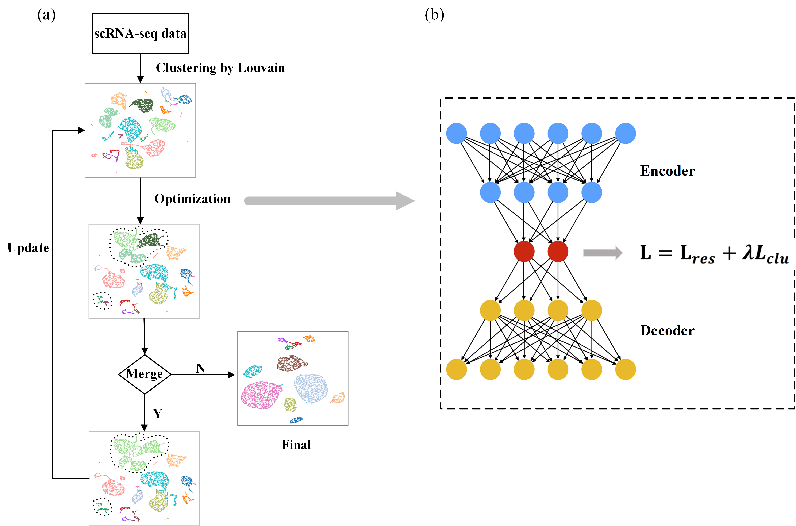

 A Parameter-free Deep Embedded Clustering Method for Single-cell RNA-seq Data
============

## Overview
Clustering analysis is widely utilized in single-cell RNA-sequencing (scRNA-seq) data to discover cell heterogeneity and cell states. While many clustering methods have been developed for scRNA-seq analysis, most of these methods require to provide the number of clusters. However, it is not easy to know the exact number of cell types in advance, and experienced determination is not always reliable. Here, we have developed ADClust, an auto-matic deep embedding clustering method for scRNA-seq data, which can accurately cluster cells without requiring a predefined number of clusters. Specifically, ADClust first obtains low-dimensional representation through pre-trained autoencoder, and uses the representations to cluster cells into initial micro-clusters. The clusters are then compared in between by a statistical test, and similar micro-clusters are merged into larger clusters. According to the clustering, cell representations are updated so that each cell will be pulled toward centres of its assigned cluster and similar clusters, while cells are separated to keep distances between clusters.  This is accomplished through jointly optimizing the carefully designed clustering and autoencoder loss functions. This merging process continues until convergence. ADClust was tested on eleven real scRNA-seq datasets, and shown to outperform existing methods in terms of both clustering performance and the accuracy on the number of the determined clusters. More importantly, our model provides high speed and scalability for large datasets.





## Requirements
Please ensure that all the libraries below are successfully installed:
- **torch 1.7.1**
- python 3.7.9
- numpy 1.19.2
- scipy 1.7.3
- scanpy 1.8.1
- louvain 0.7.0
- igraph 0.9.6


## Installation

You need to compile the dip.c file using a C compiler, and 
add the path of generated library dip.so  into LD_LIBRARY_PATH.
For this following commands need to be executed:

```

1.  gcc -fPIC -shared -o dip.so dip.c

2.  export LD_LIBRARY_PATH=$LD_LIBRARY_PATH:./dip.so

```


## Run ADClust 

### Run on the normalized example data.

```

python ADClust.py --name Baron_Mouse_normalized | Baron_Human_normalized

```


## output

The clustering cell labels will be stored in the dir `output`/dataname_pred.csv. 


## scRNA-seq Datasets

All datasets can be downloaded at [Here](https://www.synapse.org/#!Synapse:syn26524750/files/)

All datasets will be downloaded to: [data](https://github.com/biomed-AI/ADClust/tree/main/data) 


## Citation

Please cite our paper:

```

@article{zengys,
  title={A Parameter-free Deep Embedded Clustering Method for Single-cell RNA-seq Data},
  author={Yuansong Zeng, Zhuoyi Wei, Fengqi, Zhong,  Zixiang Pan, Yutong Lu, Yuedong Yang},
  journal={biorxiv},
  year={2021}
 publisher={Cold Spring Harbor Laboratory}
}

```
